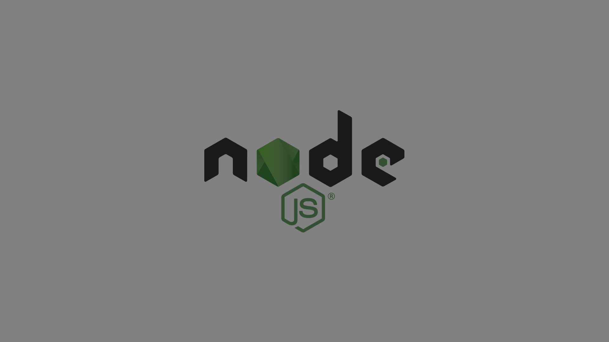

## redis-node-js-usage-example-demo

## Node.JS nedir?
#### Asenkronize, olaya dayalı, hızlı ve ölçeklenebilir sunucu uygulamaları oluşturmak için bir JavaScript alışma zamanı ortamıdır. Node.JS ölçeklenebilir ağ uygulamaları oluşturmak için tasarlanmıştır. Aşağıdaki "merhaba dünya" örneğinde, birçok bağlantı aynı anda yönetilebilir. Her bağlantıda fonksiyonlar çağrılır, ancak yapılacak iş yoksa Node.js uyku moduna geçer.

```node
const http = require('http');

const hostname = '127.0.0.1';
const port = 3000;

const server = http.createServer((req, res) => {
  res.statusCode = 200;
  res.setHeader('Content-Type', 'text/plain');
  res.end('Hello World');
});

server.listen(port, hostname, () => {
  console.log(`Server running at http://${hostname}:${port}/`);
});
```



## Redis Nedir?
#### Milyonlarca geliştirici tarafından veritabanı, önbellek, akış motoru ve mesaj aracısı, key-value pair(anahtar-değer çifti) olarak kullanılan açık kaynaklı, bellek içi veri deposu.
#### Örnek Redis Terminal Komutları:
```bash
keys * 
set name huseyin //name isimli key'i set eder.
get name huseyin //name isimli key'i getirir. 
exists name //name isimli key var mı yok mu ?
del name //name isimli key'i siler.
append user huseyin
append user " aydın" //user isimli key'e değer ekler.
hset user1 name huseyin
hset user1 last_name aydin //obje keyi oluşturur ilgili objenin fieldlerini ekler.
hget user1 email //user1 isimli objenin email keyini get eder.
hgetall user1 //user1'in tüm fieldlerini get eder.
set silinecekKey 123deger123 EX 5 //keyi set eder geçerlilik süresi atar. süre bitince silinir.
1. terminal >subscribe huso //huso kanalına abone olduk. // gördük
2. terminal >subscribe huso //huso kanalına abone olduk. //gördük
3. terminal >publish huso "selamlar" //huso kanalından yayın yapıldı.

-- Docker Kısmı --
docker run --name redisapp -p 6379:6379 redis //redis'in docker app'ını indiriyor ve çalıştırıyor.
docker images //docker image'lerini listeler.
docker run redis //redis imagesinden bir konteynır üretip çalıştırır.
docker ps //çalışan containerlerin process id'lerini alırız.
docker container ls //docker containerlerinin listesini verir.
docker exec -it [containerin ismi neyse o gelecek buraya] redis-cli //ilgili containerin üstünde redis-cli komutunu çalıştırdık.
DOCKER REDIS IMAGE SHELL>
KEYS * 
SET yeniRedisKey hoppaaa
keys *
get yeni*
get yeniRedisKey
exit
_ Bitti!
```


Tavsiye ediyorum. Tek seferde commit attım.
Node.JS ile Redis kullanımı gayet hoş.
